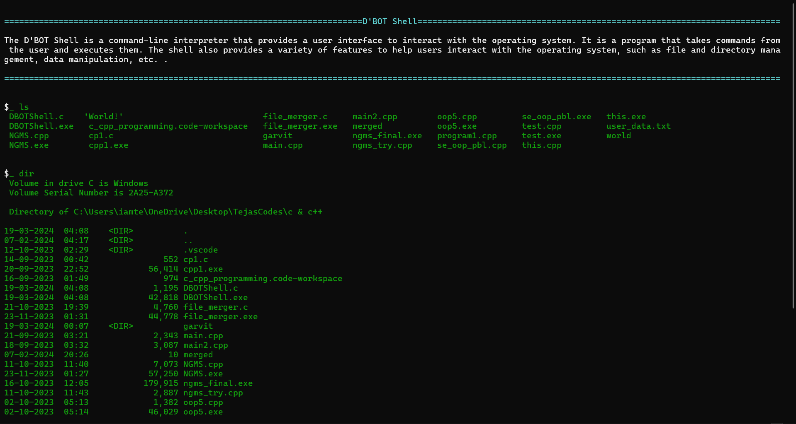

# D-BOTshell
##### :octocat: 29-02-2024

Designed and developed by [Tejas Gupta](https://github.com/multiverseweb) and [Ojas Gupta](https://github.com/ojas-git), the D'BOT Shell is a command-line interpreter that provides a user interface to interact with the operating system. It is a program that takes commands from the user and executes them. The shell also provides a variety of features to help users interact with the operating system, such as file and directory management, data manipulation, etc. .

## Abstract

The D'BOT Shell is a command-line interpreter that provides a user interface to interact with the operating system. It is a program that takes commands from the user and executes them. The shell also provides a variety of features to help users interact with the operating system, such as file and directory management, data manipulation, etc. . Some of the commands supported by this software are:
```
- ls                                            - pwd
- mkdir dir_name                                - touch file_name
- echo 'text_to_write' > file_name              - cat file_name
- wc file_name                                  - mv old_file_name new_file_name
- cp source_file_name destination_file_name     - rm file_name
- rmdir dir_name                                - date
- whoami                                        - exit
```
### Preview




---
