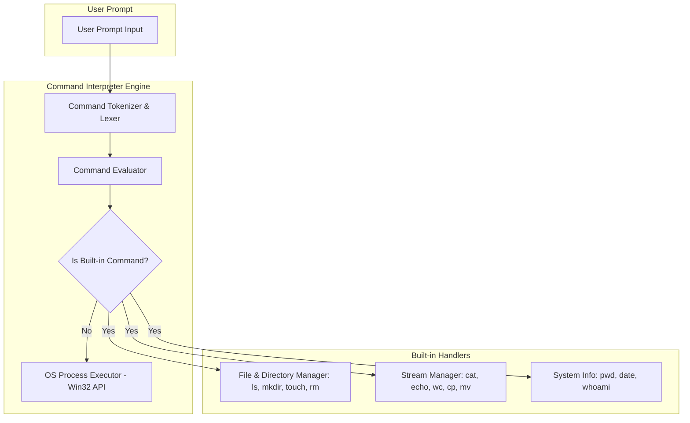

# BananaShell
##### :octocat: 21-09-2025

Designed and developed by [Tejas Gupta](https://github.com/tjiuce), [Ojas Gupta](https://github.com/ojas-git) and [Dev Jain](https://github.com/devvv180) the Banana Shell is a command-line interpreter that provides a user interface to interact with the operating system. It is a program that takes commands from the user and executes them. The shell also provides a variety of features to help users interact with the operating system, such as file and directory management, data manipulation, etc. . Some of the commands supported by this software are:
```
- ls                                            - pwd
- mkdir dir_name                                - touch file_name
- echo 'text_to_write' > file_name              - cat file_name
- wc file_name                                  - mv old_file_name new_file_name
- cp source_file_name destination_file_name     - rm file_name
- rmdir dir_name                                - date
- whoami                                        - exit
```

## Shell Architecture


```mermaid
flowchart TD
    subgraph User Prompt
        Input[User Prompt Input]
    end

    subgraph Command Interpreter Engine
        Tokenizer[Command Tokenizer & Lexer]
        Evaluator[Command Evaluator]
        BuiltIn{Is Built-in Command?}
        SystemExec[OS Process Executor - Win32 API]
    end

    subgraph Built-in Handlers
        FileOps[File & Directory Manager: ls, mkdir, touch, rm]
        StreamOps[Stream Manager: cat, echo, wc, cp, mv]
        SysOps[System Info: pwd, date, whoami]
    end

    Input --> Tokenizer
    Tokenizer --> Evaluator
    Evaluator --> BuiltIn
    BuiltIn -- Yes --> FileOps
    BuiltIn -- Yes --> StreamOps
    BuiltIn -- Yes --> SysOps
    BuiltIn -- No --> SystemExec
```

## Get BananaShell?

| [Download](https://github.com/tjiuce/BananaShell/raw/refs/heads/main/BananaShell.exe) |
|-|

## Compilation & Setup

### Using Pre-compiled Executable
1. Download `BananaShell.exe` from the release link above.
2. Run `BananaShell.exe` in your terminal or Command Prompt.

### Compiling from Source Code (`BananaShell.c`)

#### Prerequisites
- Windows OS
- GCC / MinGW compiler or MSVC (`cl.exe`)

#### Build Commands
```bash
# GCC (MinGW)
gcc BananaShell.c -o BananaShell.exe

# Run Shell
./BananaShell.exe
```

## Preview


---
